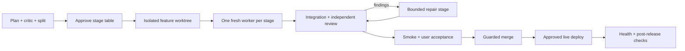

# OG Relay

**Plan once. Execute each stage in a fresh context. Release only the candidate you verified.**

OG Relay is a local feature pipeline for **Claude Code and Codex**. Both use the same Python gate engine,
plan format and durable run state. You can plan with one host and resume with the other.



## Install

Requires Python 3.10+, Git, macOS or Linux, and a configured Claude Code or Codex installation.
No Python packages, agent SDK or experimental agent-team mode required. Windows is not supported by the file lock.

```sh
git clone https://github.com/omergi313/og-relay.git
cd og-relay
python3 scripts/install.py
```

The installer installs both adapters, backs up replaced files under `~/.local/share/og-relay/backups/`, and preserves
unrelated settings/hooks. Use `--host claude` or `--host codex` to install one. Keep this checkout in place:
installed skills and the optional `~/.local/bin/og-relay` launcher reference it by absolute path. Rerun installation
if you move it. Reload Claude Code after changing skills/hooks; restart Codex if new skills do not appear.

## Use it

| Action | Claude Code | Codex |
| --- | --- | --- |
| Plan a feature | `/plan-feature search Add saved searches` | `$relay-plan search Add saved searches` |
| Split an existing plan | `/split-feature search docs/search.md` | `$relay-split search docs/search.md` |
| Execute / resume | `/ship-feature search` | `$relay-ship search` |
| Status | `/ship-feature status search` | `$relay-ship status search` |
| Smoke after revalidation | `/ship-feature smoke search` | `$relay-ship smoke search` |
| Merge, then offer live deploy | `/ship-feature finish search` | `$relay-ship finish search` |
| Retry / perform live deploy | `/ship-feature deploy search` | `$relay-ship deploy search` |
| Abandon without deleting work | `/ship-feature abandon search` | `$relay-ship abandon search` |

1. Plan or split, then review `plans/<slug>/README.md` and approve the stage table.
2. In a fresh session, ship the slug. The approved plan is committed on the base; implementation gets a separate
   worktree. Allow access to that returned worktree through your host's normal permissions. Set up its dependencies
   from lockfiles (for example `make setup` in Money); no secrets or real databases belong in the feature tree.
3. Test the fixture URL using the generated acceptance checklist. Record actual acceptance of that candidate.
4. Approve merge and, separately, live deployment. Complete post-release checks to close the run.

The model and reasoning effort are your choice. OG Relay does not hardcode Opus, a Codex model, or permission bypasses.
Fresh stage workers use the files as their handoff; the lead stays focused on scheduling and evidence.

## Configure a project

Copy [examples/relay.json](examples/relay.json) to `relay.json` in your project and adapt the commands. Commit it.
Commands are argv arrays: use `["sh", "-c", "..."]` explicitly if a trusted project command needs a shell.
Config can instead live privately at `<git-common-dir>/og-relay/config.json`; tracked `relay.json` takes precedence.

Smoke callbacks run in the feature checkout. Live callbacks run in a new **detached worktree at the merge commit**.
They receive `RELAY_SOURCE_DIR`, `RELAY_WORKTREE`, `RELAY_RELEASE_DIR`, `RELAY_RUN_DIR`, and `RELAY_SHA`.
Provide a read-only `isolation_check` that rejects live processes serving the source/feature checkout, plus idempotent `stop`, `backup`, `start`, and `health` commands. Health must identify the expected process/version,
not merely any listener on a port. Backups must print their locations into the retained command log. Never update
files beneath a running live process or point smoke at the persistent live database.

For the original Money project on macOS:

```sh
python3 scripts/configure_money.py /path/to/money
```

This installs private configuration only. It **does not restart live**. The first approved deploy stops the recognized
old live process, waits for worker shutdown, makes an integrity-checked SQLite backup, and starts from the pinned release. Money's `.data` and
optional `.env` stay external and are linked only into live releases. An existing legacy live process still serves its old checkout until cutover. The merge guard refuses to update that checkout while live is serving it. After explicit approval, run `python3 scripts/bootstrap_money.py /path/to/money --confirmed` to move the **current base** into a pinned release before the first feature merge. This backs up data and restarts live; configuration/installation alone never does. Never implement new features in the legacy checkout; Relay creates a separate one. See [deployment and rollback](docs/DEPLOYMENT.md).

## What the gates enforce

- **Serial, isolated work:** one writer, one feature worktree, separate immutable-in-use live releases. Parallel
  scheduling is intentionally not implemented in v1.
- **Validated completion:** required handoff fields, exact reachable stage commits, owned paths across the full
  attempt, runner-executed tests and retained log hashes. Recovery uses the same validator as normal completion.
- **Commit-bound release evidence:** integration, independent review report, smoke health and user acceptance must
  match the current candidate. Manual fixes and review repairs require revalidation. Blocking findings stop release.
- **Explicit user actions:** prerequisite actions block dependents; release actions block merge; post-release actions
  block closeout. “Implemented” is not synonymous with “ready to release.”
- **Durable deployment state:** merge SHA, release checkout, backup logs and failures survive interruption. State is
  retained after successful release and after abandonment.

These are cooperative process controls, not a sandbox against malicious agents editing their own evidence. Host
permissions still apply. The engine cannot prove a human truly tested a UI or an agent reviewed independently;
the host skills require those actions before recording the corresponding attestations.

## Files and commands

| Location | Purpose |
| --- | --- |
| `relay.py` | Shared CLI, stage validation, evidence and release lifecycle |
| `adapters/claude/` | Claude skills and role definitions |
| `adapters/codex/` | Codex skills and UI metadata |
| `docs/PLAN.md`, `STAGE.md`, `SHIP.md` | Shared protocols used by both hosts |
| `scripts/` | Installer, Claude completion hook, Money runtime adapter |
| `examples/` | Project config, stage schema examples and report shapes |
| `tests/` | Isolated Git lifecycle and installer regression tests |
| `claude-agent-teams/` | The lighter Claude Code variant: shared working tree, agent teams, no engine ([README](claude-agent-teams/README.md)) |

Plans live in `plans/<slug>/`. Operational state/logs live in `<git-common-dir>/og-relay/runs/<slug>/` and are not
published with source. Keep that directory in local backups if you need recovery after losing the repository.
Feature and release checkouts live next to the project under `.og-relay/<project>/`.

```sh
python3 relay.py --help
python3 relay.py --repo /path/to/project status search
python3 -m unittest discover -s tests -v
```

Read the [command reference](docs/COMMANDS.md), [migration guide](docs/MIGRATION.md), and
[deployment guide](docs/DEPLOYMENT.md) for recovery and project setup.

## Host references

Adapter behavior follows the official [Codex skill discovery](https://learn.chatgpt.com/docs/build-skills),
[Codex subagent guidance](https://learn.chatgpt.com/docs/agent-configuration/subagents),
[Claude skills](https://code.claude.com/docs/en/skills), and
[Claude TaskCompleted hook](https://code.claude.com/docs/en/hooks#taskcompleted) documentation.
Host interfaces can evolve; the standalone gate engine and manual fresh-session prompts remain usable independently.
